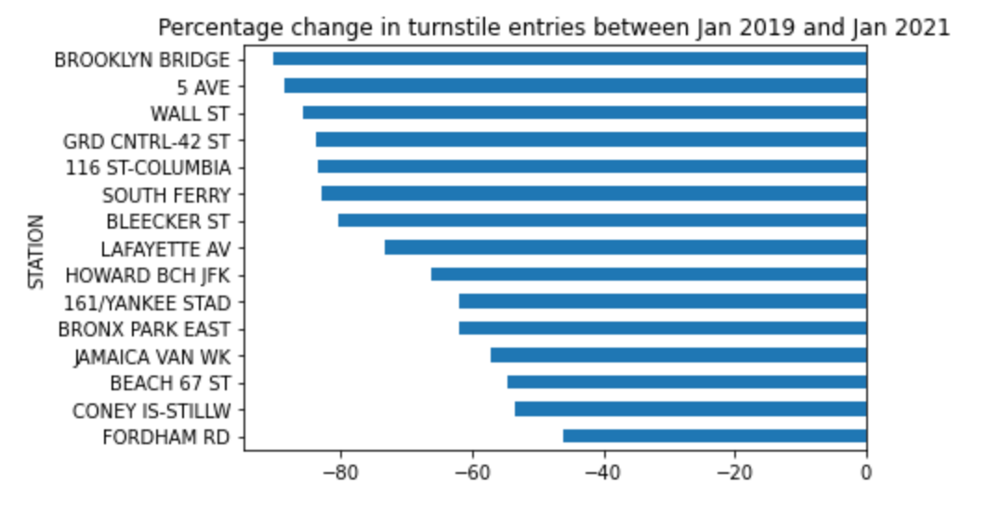

# EDA Project MVP

## Crazy Donuts' pre-negotiation NYC subway station footfall analysis

The goal of this project is to equip Crazy Donuts with MTA data on how footfall outside their concession premises in NYC subway stations has changed as a result of the Coronavirus Pandemic.

The figure depicts the percentage change in daily turnstile entries between January 2019 and January 2021 for NYC subway stations which house Crazy Donuts concessions. The percentage number here is the difference between the two months expressed as a percentage of the 2019 totals (i.e. a 100% reduction would mean zero passenger entries in Jan 2021).

The figure shows a significant reduction in passenger traffic at all stations. The most affected of Crazy Donuts' stations, Brooklyn Bridge, saw its turnstile entries down by 90%.

It also shows the percent reduction differs significantly according to station. The least affected relevant station, Fordham Road, saw a 46% cut in passenger entries. So Fordham Road kept more than half its passengers, while Brooklyn Bridge kept only 10%.

It will be interesting to see how these results are affected by including data from other months apart from January, narrowing the time-window down to 'Donut Time' (i.e. the morning commute), and including exits as well as entries. 